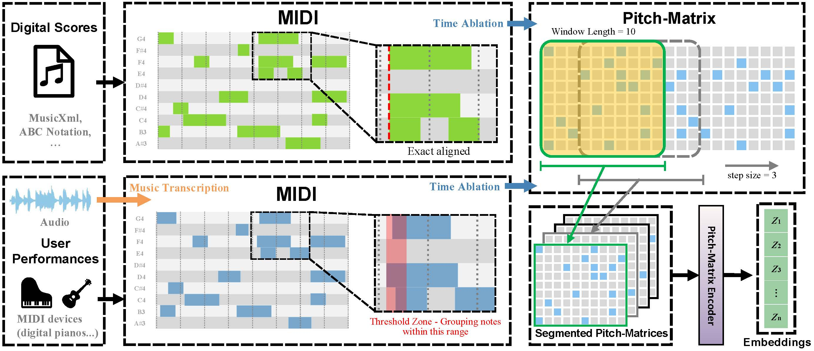

# MIDI-Zero

A self-supervised learning framework for content-based music retrieval (CBMR).

## **Method Overview**

**MIDI-Zero** is a self-supervised learning framework for content-based music retrieval (CBMR), supporting tasks such as **Audio Identification, Audio Matching, and Version Identification**. Operating entirely on **MIDI representations**, it eliminates the need for external labeled data by generating task-specific training data automatically. This provides a **robust and scalable solution** for bridging audio and symbolic music retrieval.



### **Processing Pipeline**
MIDI-Zero standardizes MIDI representations as input, regardless of their origin, and processes them through the following stages:

1. **MIDI Input & Alignment**  
   - Accepts MIDI from **Digital Scores (e.g., MusicXML, ABC Notation)** and **User Performances (MIDI instruments or transcribed audio)**.
   - Digital scores are directly aligned, while transcribed MIDI undergoes **threshold-based note grouping** to handle timing variations.

2. **Pitch-Matrix Construction**  
   - Applies **time ablation** to segment MIDI data into overlapping **Pitch-Matrices** with a fixed window length (e.g., 10 frames) and a step size of 2.

3. **Feature Encoding**  
   - A **ResNet-based Pitch-Matrix Encoder** transforms segmented Pitch-Matrices into **compact embeddings**, making them suitable for retrieval tasks.

4. **CBMR Task Execution**  
   - The embeddings are used for **Audio Identification, Matching, and Version Identification**, enabling efficient retrieval across symbolic and audio music domains.


## **Training Data Sources**

The `generate_training_data` function provides four modes for data generation, ensuring diverse and flexible training samples:

### **1. C Mode (Completely Random)**
- **Source**: Fully synthetic data.  
- **Description**: Notes in each frame are randomly sampled from a predefined pitch range.  
- **Real Data Requirement**: ❌ Not required.  
- **Use Case**: Useful for exploring diverse and randomized inputs.

### **2. S Mode (Statistical-based)**
- **Source**: Precomputed statistical distributions.  
- **Description**: Uses unigram and bigram probabilities from a given `frame_dist_file` to generate structured sequences.  
- **Real Data Requirement**: ✅ Required to extract statistical distributions.  
- **Use Case**: Helps in generating data that mimics real-world statistical patterns.

### **3. P Mode (Probability-based)**
- **Source**: Normal distribution sampling.  
- **Description**: Notes and note counts are sampled using **Normal distributions** for pitch and frame complexity.  
- **Real Data Requirement**: ❌ Not required.  
- **Use Case**: Provides a balance between structured and randomized data, allowing for controlled variations.

### **4. R Mode (Real Data)**
- **Source**: Authentic MIDI datasets.  
- **Description**: Uses real-world MIDI files or datasets as direct training data.  
- **Real Data Requirement**: ✅ Required MIDI datasets.  
- **Use Case**: Ensures training on real-world compositions for optimal retrieval accuracy.

### **Example Usage**

```python
from data.data_generator import generate_training_data

# Generate probability-based training data
data = generate_training_data(
    mode="P",  # Probability-based generation
    win_length=10,  # Sequence length (number of frames)
    note_max=12,  # Max notes per frame
    pitch_range=(21, 108),  # Pitch range
    num_samples=10000,  # Number of samples to generate
    pitch_only=True,  # Generate pitch-only data
    p_mean=64.0,  # Mean of pitch Normal distribution
    p_std=24.0,  # Std deviation of pitch Normal distribution
    n_mean=6.0,  # Mean of note count Normal distribution
    n_std=2.5,  # Std deviation of note count Normal distribution
    save_path="probability_based_data.pkl"  # Save path
)
```

## Training  

The training module supports different data sources and configurations. For real data (**R**), MIDI files need to be processed into JSON format using `from data.dataset import preprocess_and_save_midi_data`, and the generated file path should be set in `train_data_path`. In statistical-based mode (**S**), a `frame_dist_path` file is required, which is extracted from real MIDI data using `from dataset.data_analysis import extract_frame_distributions` and used to generate training data based on probability distributions. For completely random (**C**) and probability-based (**P**) modes, no pre-existing training data is needed, as it is generated dynamically according to predefined rules.  

To start training, run the following command:  

```bash
python train.py --data_source R --train_data_path path/to/data.json
```

## Evaluation  

The evaluation process is implemented in `eval.py` using the `eval` method, which assesses the model's retrieval performance based on a given dataset. The evaluation requires several inputs:  

- **Database Path (`db_path`)**: The folder path containing the MIDI files used as the retrieval database.  
- **Query Path (`query_path`)**: The folder path containing the MIDI query files.  
- **Ground Truth File (`gt_file_path`)**: A CSV file mapping query file names to their corresponding database file names for evaluation metrics computation.  
- **Checkpoint Path (`checkpoint_path`)**: The path to the trained model's checkpoint for feature extraction.   

The **BeginnerPiano dataset** can be downloaded from the following link:  [Dataset Download](https://pan.baidu.com/s/1rsesvzEPzHhqglHws_vZ5g), the extraction code is c8xq.

## Citation
Please cite the following paper if you use the code or dataset provided in this repository.

```bibtex
@inproceedings{su2025midi,
  title={MIDI-Zero: A MIDI-driven Self-Supervised Learning Approach for Music Retrieval},
  author={Su, Yuhang and Hu, Wei and Gao, Hongfeng and Zhang, Fan},
  booktitle={Proceedings of the 48th International ACM SIGIR Conference on Research and Development in Information Retrieval},
  pages={348--357},
  year={2025}
```
